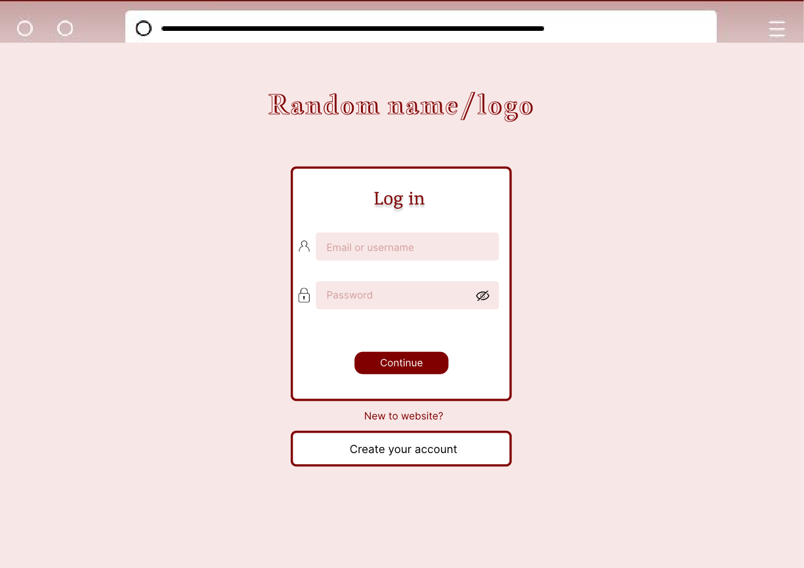
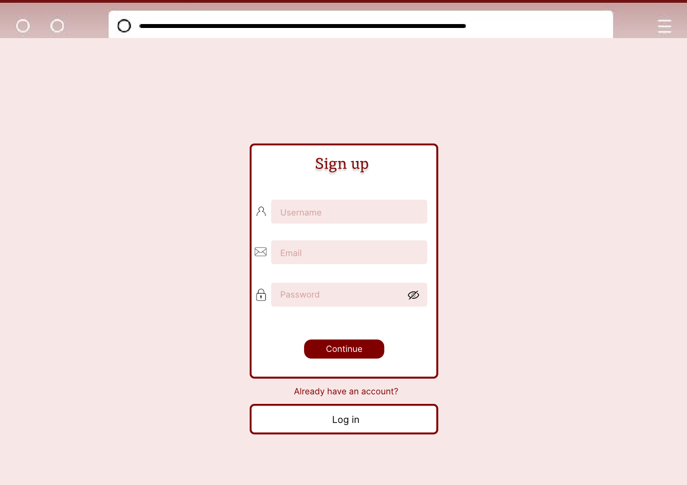
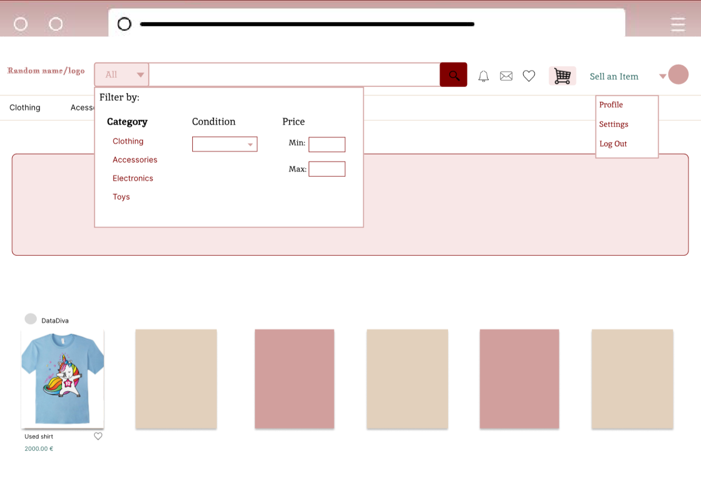
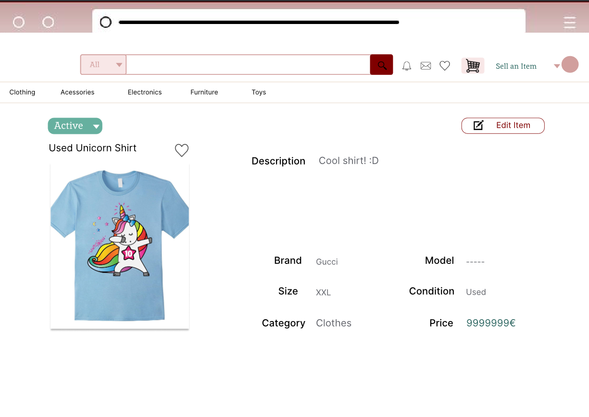
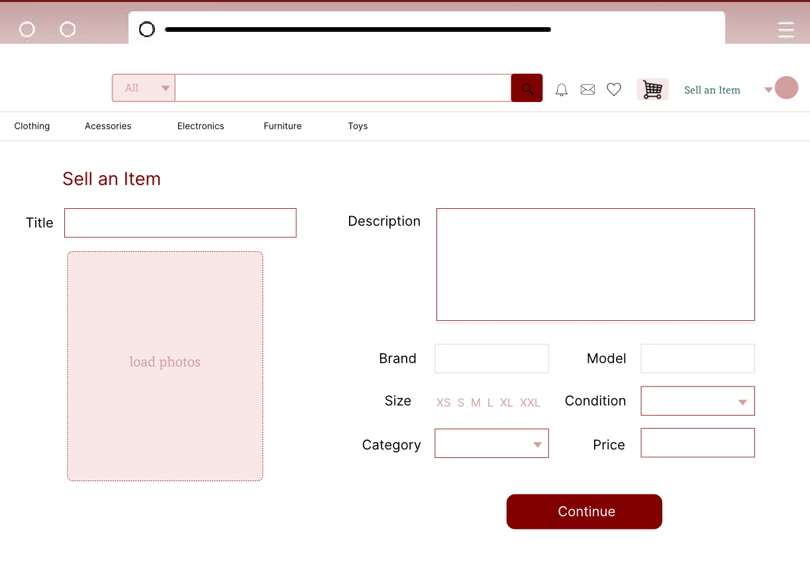
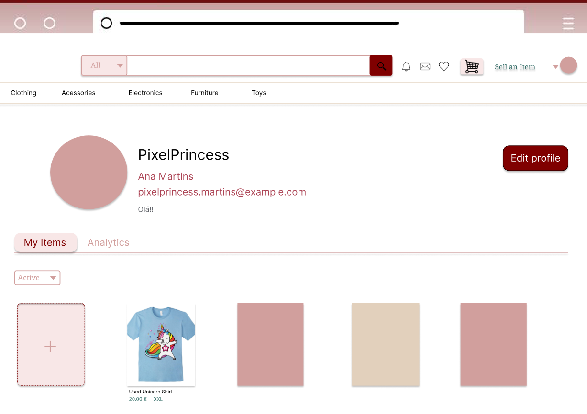
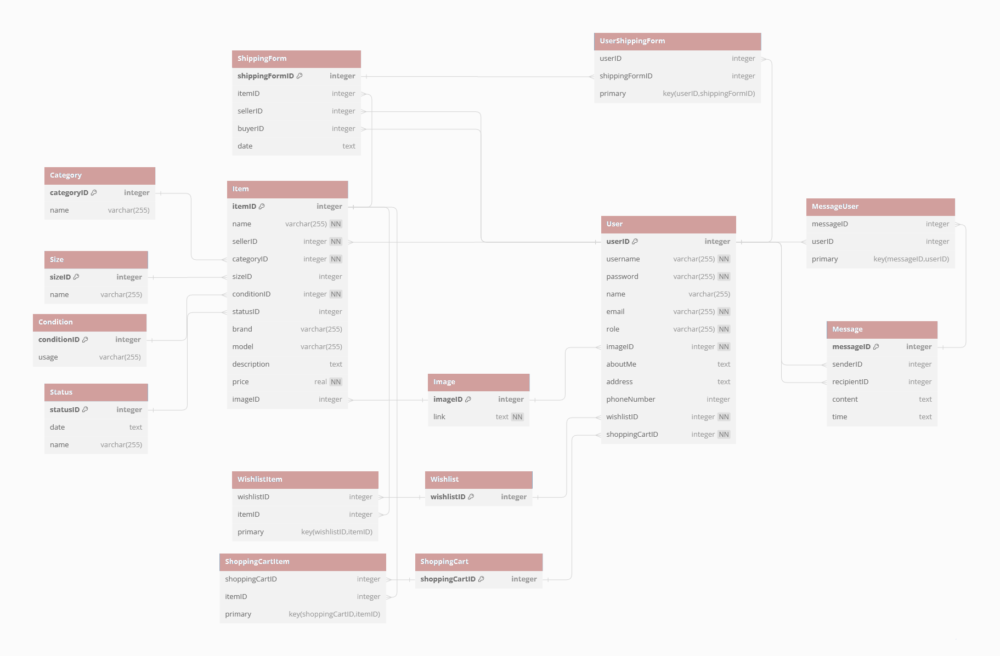

# LTW Project ltw04g06
## Objective
Develop a website that facilitates the buying and selling of pre-loved items

## Project done by:
  
Alexandre Torres Costa up202207499

  
Beatriz Alexandra de Almeida Bernardo up202206097

  
Diana Magalhães Moreira Nunes up202208247

## Some credentials:
   
(Username/Password)

  
 john_doe / john_doe1

   
alice_wonderland / alice_wonder1

## Features
  
Register a new account.

  
Log in and out.

    
Edit their profile, including their name, username, password, and email.

   
List new items, providing details such as category, brand, model, size, and condition, along with images.

   
Track and manage their listed items.

   
Respond to inquiries from buyers regarding their items and add further information if needed.

   
Print shipping forms for items that have been sold.

   
    Browse items using filters like category, price, and condition.

   
    Engage with sellers to ask questions or negotiate prices.

   
    Add items to a wishlist or shopping cart.

   
    Proceed to checkout with their shopping cart (simulate payment process).

   
    Elevate a user to admin status.

   
    Introduce new item categories, sizes, conditions, and other pertinent entities.

   
    Oversee and ensure the smooth operation of the entire system.

  ## Instalation 
   git clone <[your_repo_url](https://github.com/FEUP-LTW-2024/ltw-project-2024-ltw04g06)>
    git checkout final-delivery-v1
    php -S localhost:9000

   

   

# MockUps

  

    
    
<b><i>Fig 1. Log in</i></b>

  

  

    
    
<b><i>Fig 2. Sign up</i></b>

  

  

    
    
<b><i>Fig 3. Main Page </i></b>

  

 
 

  

    
    
<b><i>Fig 4. View Item</i></b>

  

  

    
    
<b><i>Fig 5. Sell Item</i></b>

  

    

    
    
<b><i>Fig 6. Profile </i></b>

  

## UML

  

  
  <b><i>Fig 7. UML </i></b>

